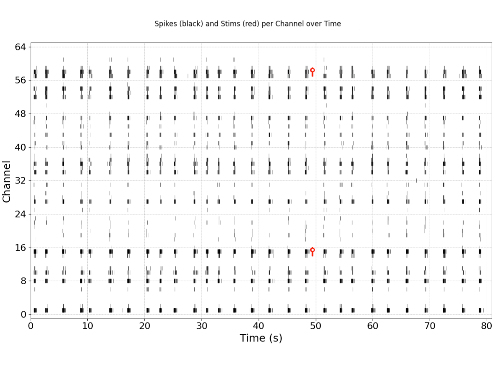
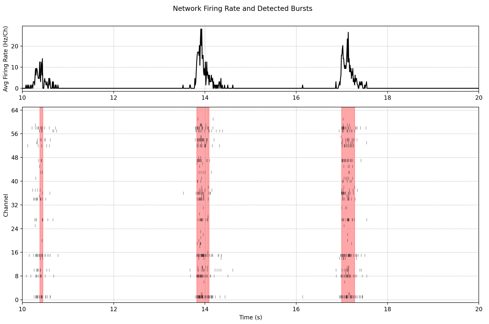
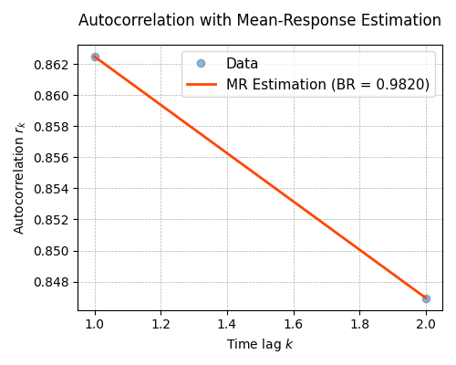
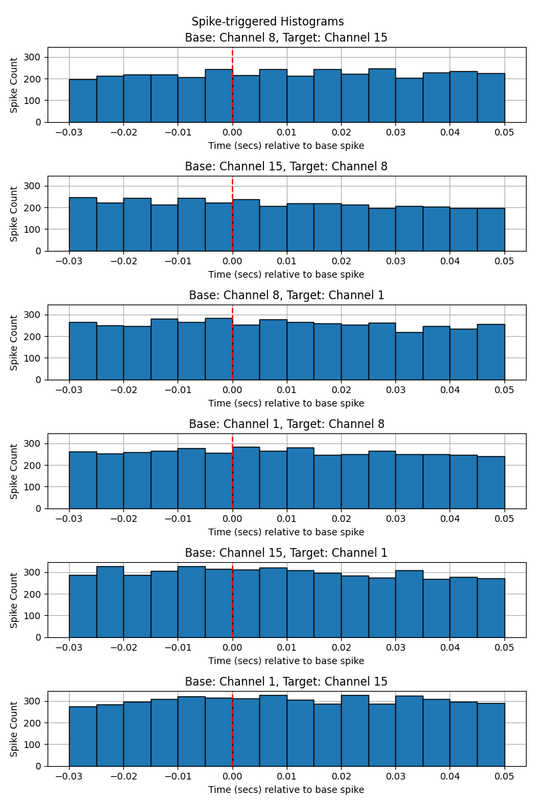
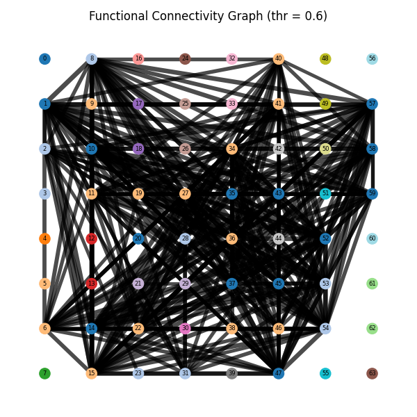

# Cortical Labs Analysis Toolkit

A modular analysis package for computing electrophysiological and network-level metrics from multi-channel neural recordings of CL1.  

The library exposes a **high-level `cl.RecordingView` API** that coordinates a suite of rigorously implemented metric functions.


# Quick Start

`cl.RecordingView` is the central interface for analysis. It provides a standardised view over a neural recording and exposes convenience methods that internally call the metric functions defined in this package.

```python
from cl import RecordingView
recording_path = "path/to/recording.h5"
recording      = RecordingView(recording_path)

# To calculate a metric, replace "metric" with one of the implemented metrics
# Each result object is a type of `AnalysisResult`
result = recording.analyse_metric()

# To create a plot
result.plot()

# To save a result
result.save("path/to/result.json")

# Load a previously saved result
result = AnalysisResult.from_file("path/to/result.json")
```
---

# Implemented Metrics

This document describes **all public analysis and visualisation functions** exposed by `RecordingView`.
All analysis functions return **typed result objects** that are sub-classed from `AnalysisResult` (e.g. `AnalysisResultFiringStats`). These objects expose metric values and are designed to be inspectable and reusable in downstream analysis.

The table below lists all public analysis and visualisation methods exposed by `cl.RecordingView`.  

| RecordingView method                                                                                 | Short description                                                     |
|------------------------------------------------------------------------------------------------------|-----------------------------------------------------------------------|
| `cl.RecordingView.plot_spikes_and_stims`                                                             | Raster plot of spikes and optional stimulation events.                |
| `cl.RecordingView.analyse_firing_stats` returns `AnalysisResultFiringStats`                          | Basic firing statistics from binned spike activity.                   |
| `cl.RecordingView.analyse_network_bursts` returns `AnalysisResultNetworkBursts`                      | Detect network-level bursts using population spike-rate thresholding. |
| `cl.RecordingView.analyse_criticality` returns `AnalysisResultCriticality`                           | Detect neuronal avalanches and compute criticality metrics.           |
| `cl.RecordingView.analyse_information_entropy` returns `AnalysisResultInformationEntropy`            | Per-bin Bernoulli entropy from fraction of active channels.           |
| `cl.RecordingView.analyse_lempel_ziv_complexity` returns `AnalysisResultComplexityLempelZiv`         | Per-channel LZ78 complexity of binned spike sequences.                |
| `cl.RecordingView.analyse_dct_features` returns `AnalysisResultDctFeatures`                          | Spatial DCT features from per-channel spike counts on the MEA layout. |
| `cl.RecordingView.analyse_spike_triggered_histogram` returns `AnalysisResultSpikeTriggeredHistogram` | Spike-triggered histograms for ordered channel pairs.                 |
| `cl.RecordingView.analyse_functional_connectivity` returns `AnalysisResultsFunctionalConnectivity`   | Functional connectivity and additional graph summaries.               |


---

# Result Objects and Visualisation

All analysis functions described above return **typed result objects** (e.g. `AnalysisResultCriticality`, `AnalysisResultDctFeatures`). These result objects are designed to support standardised visualisation.

## Saving and Loading Results

All result objects support persistence and can be **saved to disk and reloaded** without recomputation.  

Typical usage pattern:

```python
result = recording.analyse_criticality(...)
result.save("criticality_result.json")

loaded = AnalysisResultCriticality.from_file("criticality_result.json")
```

Saved results include:

* Computed metric values
* Analysis parameters
* Metadata required for reproducibility
* (Optional) Metadata required for plotting

---
### Basic Visualisation

`cl.RecordingView.plot_spikes_and_stims` creates a raster plot of spike events and (optionally) stimulation events for a neural recording, with optional restrictions on the displayed time range and channel subset.

```python
from cl import RecordingView
recording = RecordingView(recording_path)
recording.plot_spikes_and_stims()
```

<p align="center">
  
</p>
<p align="center">
  <em>Figure: Detected spikes and delivered stimulations on sample recorded channels.</em>
</p>


---
### Built-in Plotting Interface

Some result objects provide a `.plot()` method for **quick, standardised visualisation** of the analysis outcome.
These plotting methods are intended for exploratory analysis, diagnostics, and reporting.

The following result types expose a `.plot()` interface:

* **Network burst analysis**
* **Discrete Cosine Transform (DCT) features**
* **Criticality analysis**
* **Spike-triggered histograms**
* **Functional connectivity**

---
## Network burst analysis

Created with `AnalysisResultNetworkBursts.plot()`.

<p align="center">
  
</p>
<p align="center">
  <em>Figure: Average network firing and detected network bursts.</em>
</p>


```python
result = recording.analyse_network_bursts()
result.plot()
```

---
## Discrete Cosine Transform (DCT)

Created with `AnalysisResultDctFeatures.plot()`.

<p align="center">
  
</p>
<p align="center">
  <em>Figure: Spatial DCT basis functions (k = 3) defined over the MEA layout.</em>
</p>


```python
result = recording.analyse_dct_features(k=3)
result.plot()
```

---

## Criticality Analysis

Created with `AnalysisResultCriticality.plot_avalanche_sizes()`, `AnalysisResultCriticality.plot_avalanche_durations()`, and `AnalysisResultCriticality.plot_deviation_from_criticality_coefficient()`.

<p align="center">
  
  
  
</p>
<p align="center">
  <em>Figure: Neuronal avalanche size and duration distributions as well as the DCC estimation.</em>
</p>

Created with `AnalysisResultCriticality.plot_branching_ratio()`.

<p align="center">
  
</p>
<p align="center">
  <em>Figure: Branching ratio estimated.</em>
</p>

Created with `AnalysisResultCriticality.plot_avalanche_shape_collapse_analysis()`.

<p align="center">
  
</p>
<p align="center">
  <em>Figure: Neuronal avalanche shape collapse metrics and scaled avalanche profiles.</em>
</p>


```python
result = recording.analyse_criticality(...)
result.plot_avalanche_sizes()
result.plot_avalanche_durations()
result.plot_deviation_from_criticality_coefficient()
result.plot_branching_ratio()
result.plot_avalanche_shape_collapse_analysis()
```

---

## Spike-Triggered Histograms

Created with `AnalysisResultSpikeTriggeredHistogram.plot()`.

<p align="center">
  
</p>
<p align="center">
  <em>Figure: Spike-triggered histogram results visualise selected population responses aligned to trigger spikes from selected high-activity channels.</em>
</p>

```python
result = recording.analyse_spike_triggered_histogram(...)
result.plot()
```

---

## Functional Connectivity

Created with `AnalysisResultsFunctionalConnectivity.plot()`.

<p align="center">
  
</p>
<p align="center">
  <em>Figure: Functional connectivity results support visualisation of derived graph representations, where edge weights encode pairwise correlation strengths and node colours indicate membership in detected Louvain communities.
.</em>
</p>

```python
result = recording.analyse_functional_connectivity(...)
result.plot()
```

---

# Notes

* Plotting methods are **non-destructive** and do not modify stored results.
* Saved result files remain fully compatible with plotting after reload.

---
